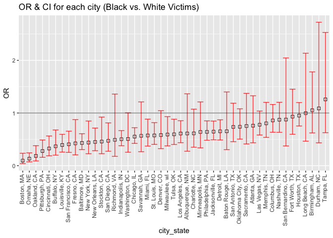
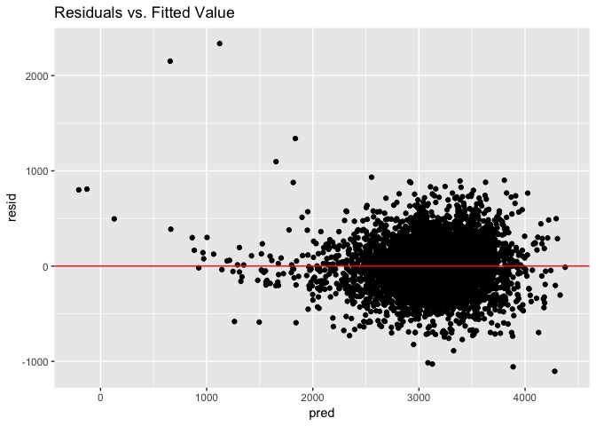
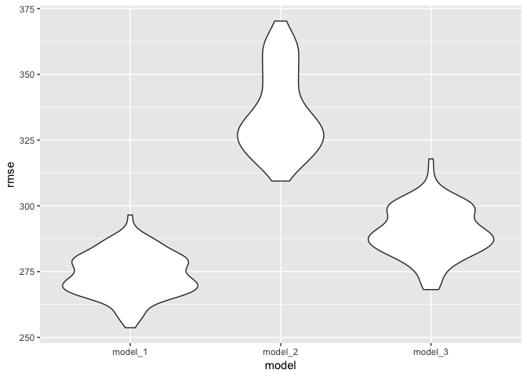

p8105\_hw6\_jz3036
================
Junyuan Zheng (jz3036)
2018-11-17

-   Import necessary packages.

``` r
library(tidyverse)
```

    ## ── Attaching packages ─────────────────────────────────────────────────────────── tidyverse 1.2.1 ──

    ## ✔ ggplot2 3.0.0     ✔ purrr   0.2.5
    ## ✔ tibble  1.4.2     ✔ dplyr   0.7.8
    ## ✔ tidyr   0.8.1     ✔ stringr 1.3.1
    ## ✔ readr   1.1.1     ✔ forcats 0.3.0

    ## ── Conflicts ────────────────────────────────────────────────────────────── tidyverse_conflicts() ──
    ## ✖ dplyr::filter() masks stats::filter()
    ## ✖ dplyr::lag()    masks stats::lag()

``` r
library(modelr)
```

Problem 1
=========

``` r
data_p1 = 
  read_csv(file='./homicide_data/homicide-data.csv')
```

-   Create a city\_state variable (e.g. “Baltimore, MD”), and a binary variable indicating whether the homicide is solved.
-   Omit cities Dallas, TX; Phoenix, AZ; and Kansas City, MO – these don’t report victim race. Also omit Tulsa, AL.
-   Modifiy victim\_race to have categories white and non-white, with white as the reference category. Be sure that victim\_age is numeric.

``` r
data_p1_city = 
  mutate(data_p1, city_state = paste(city, state, sep = ', '),
                  solved = ifelse(disposition == 
                        'Closed without arrest' | disposition == 'Open/No arrest', 0, 1)) %>%
  filter(., city_state != 'Dallas, TX', city_state != 'Phoenix, AZ',
            city_state != 'Kansas City, MO', city_state != 'Tulsa, AL') %>% 
  mutate(., victim_race_white = ifelse(victim_race == 'White', 'White', 'Non-white'),
            victim_race = fct_relevel(victim_race, "White"),
            victim_age = as.numeric(victim_age))
```

    ## Warning in evalq(as.numeric(victim_age), <environment>): NAs introduced by
    ## coercion

``` r
head(data_p1_city)
```

    ## # A tibble: 6 x 15
    ##   uid   reported_date victim_last victim_first victim_race victim_age
    ##   <chr>         <int> <chr>       <chr>        <fct>            <dbl>
    ## 1 Alb-…      20100504 GARCIA      JUAN         Hispanic            78
    ## 2 Alb-…      20100216 MONTOYA     CAMERON      Hispanic            17
    ## 3 Alb-…      20100601 SATTERFIELD VIVIANA      White               15
    ## 4 Alb-…      20100101 MENDIOLA    CARLOS       Hispanic            32
    ## 5 Alb-…      20100102 MULA        VIVIAN       White               72
    ## 6 Alb-…      20100126 BOOK        GERALDINE    White               91
    ## # ... with 9 more variables: victim_sex <chr>, city <chr>, state <chr>,
    ## #   lat <dbl>, lon <dbl>, disposition <chr>, city_state <chr>,
    ## #   solved <dbl>, victim_race_white <chr>

-   For the city of Baltimore, MD, use the glm function to fit a logistic regression with resolved vs unresolved as the outcome and victim age, sex and race (as just defined) as predictors.
-   Save the output of glm as an R object; apply the broom::tidy to this object; and obtain the estimate and confidence interval of the adjusted odds ratio for solving homicides comparing black victims to white victims keeping all other variables fixed.

``` r
fit_logistic_Baltimore = 
  filter(data_p1_city, city_state == 'Baltimore, MD') %>% 
  glm(solved ~ victim_age + victim_sex + victim_race, data = ., family = binomial())

fit_logistic_Baltimore %>% 
  broom::tidy(.) %>% 
  mutate(., OR = exp(estimate),
            CI_low = estimate - std.error*qt(0.975, 2820),
            CI_high = estimate + std.error*qt(0.975, 2820),
            exp_CI_low = exp(CI_low),
            exp_CI_high = exp(CI_high)) %>%
  select(., term, OR, exp_CI_low, exp_CI_high) %>%
  filter(., term == 'victim_raceBlack')
```

    ## # A tibble: 1 x 4
    ##   term                OR exp_CI_low exp_CI_high
    ##   <chr>            <dbl>      <dbl>       <dbl>
    ## 1 victim_raceBlack 0.431      0.306       0.607

-   Now run glm for each of the cities in your dataset, and extract the adjusted odds ratio (and CI) for solving homicides comparing black victims to white victims. Do this within a “tidy” pipeline, making use of purrr::map, list columns, and unnest as necessary to create a dataframe with estimated ORs and CIs for each city.

``` r
fit_logistic_all_cities = 
data_p1_city %>% 
  group_by(., city_state) %>% 
  nest(.) %>% 
  mutate(models = map(data, ~glm(solved ~ victim_age + victim_sex + victim_race,
                                 data = .x, family = binomial())),
         models = map(models, broom::tidy)) %>% 
  select(-data) %>% 
  unnest() %>% 
  mutate(., OR = exp(estimate),
            CI_low = estimate - std.error*qt(0.975, 2820),
            CI_high = estimate + std.error*qt(0.975, 2820),
            exp_CI_low = exp(CI_low),
            exp_CI_high = exp(CI_high)) %>%
  select(., city_state, term, OR, exp_CI_low, exp_CI_high) %>% 
  filter(., term == 'victim_raceBlack')
fit_logistic_all_cities
```

    ## # A tibble: 47 x 5
    ##    city_state      term                 OR exp_CI_low exp_CI_high
    ##    <chr>           <chr>             <dbl>      <dbl>       <dbl>
    ##  1 Albuquerque, NM victim_raceBlack 0.612      0.274        1.36 
    ##  2 Atlanta, GA     victim_raceBlack 0.760      0.435        1.33 
    ##  3 Baltimore, MD   victim_raceBlack 0.431      0.306        0.607
    ##  4 Baton Rouge, LA victim_raceBlack 0.653      0.305        1.40 
    ##  5 Birmingham, AL  victim_raceBlack 1.05       0.622        1.78 
    ##  6 Boston, MA      victim_raceBlack 0.0964     0.0394       0.236
    ##  7 Buffalo, NY     victim_raceBlack 0.368      0.200        0.678
    ##  8 Charlotte, NC   victim_raceBlack 0.613      0.351        1.07 
    ##  9 Chicago, IL     victim_raceBlack 0.552      0.423        0.721
    ## 10 Cincinnati, OH  victim_raceBlack 0.326      0.188        0.564
    ## # ... with 37 more rows

-   Create a plot that shows the estimated ORs and CIs for each city. Organize cities according to estimated OR, and comment on the plot.

``` r
fit_logistic_all_cities %>%
  mutate(city_state = fct_reorder(city_state, OR)) %>% 
  ggplot(aes(x = city_state, y = OR)) +
  geom_point(shape = 22, size = 2, fill = 'white') +
  geom_errorbar(aes(ymin = exp_CI_low, ymax = exp_CI_high), colour='red', alpha = 0.8) +
  theme(axis.text.x = element_text(angle = 90, hjust = 1, vjust = 0.3)) +
  labs(title = 'OR & CI for each city (Black vs. White Victims)') +
  geom_hline(yintercept = 1, alpha = 0.5)
```



As shown by the plot above, all the OR fall in the CI range, which could mean the results are statistically significant if not look at the p-value directly. Most of the OR is lower than 1, which means, compared to white victims, cases with black victims at those cities are less likely to be solved. The only three cities where cases with black victims are more likely to be solved than those having white victims are Birminghan, Durham, and Tampa.

Problem 2
=========

-   Load and clean the data for regression analysis (i.e. convert numeric to factor where appropriate, check for missing data, etc.).

``` r
data_p2 = 
  read_csv(file='./birthweight_data/birthweight.csv')
```

``` r
data_p2[!complete.cases(data_p2),]
```

    ## # A tibble: 0 x 20
    ## # ... with 20 variables: babysex <int>, bhead <int>, blength <int>,
    ## #   bwt <int>, delwt <int>, fincome <int>, frace <int>, gaweeks <dbl>,
    ## #   malform <int>, menarche <int>, mheight <int>, momage <int>,
    ## #   mrace <int>, parity <int>, pnumlbw <int>, pnumsga <int>, ppbmi <dbl>,
    ## #   ppwt <int>, smoken <dbl>, wtgain <int>

Check for missing data returns 0 rows, which means no missing data in the raw dataset.

``` r
data_p2_reg = 
  data_p2 %>% 
  mutate(., babysex = replace(babysex, babysex == 1, 'male'),
            babysex = replace(babysex, babysex == 2, 'female'),
            babysex = as_factor(babysex),
            frace = replace(frace, frace == 1, 'White'),
            frace = replace(frace, frace == 2, 'Black'),
            frace = replace(frace, frace == 3, 'Asian'),
            frace = replace(frace, frace == 4, 'Puerto Rican'),
            frace = replace(frace, frace == 8, 'Other'),
            frace = replace(frace, frace == 9, 'Unknown'),
            frace = as_factor(frace),
            malform = replace(malform, malform == 0, 'absent'),
            malform = replace(malform, malform == 1, 'present'),
            malform = as_factor(malform),
            mrace = replace(mrace, mrace == 1, 'White'),
            mrace = replace(mrace, mrace == 2, 'Black'),
            mrace = replace(mrace, mrace == 3, 'Asian'),
            mrace = replace(mrace, mrace == 4, 'Puerto Rican'),
            mrace = replace(mrace, mrace == 8, 'Other'),
            mrace = as_factor(mrace),
         )
data_p2_reg
```

    ## # A tibble: 4,342 x 20
    ##    babysex bhead blength   bwt delwt fincome frace gaweeks malform menarche
    ##    <fct>   <int>   <int> <int> <int>   <int> <fct>   <dbl> <fct>      <int>
    ##  1 female     34      51  3629   177      35 White    39.9 absent        13
    ##  2 male       34      48  3062   156      65 Black    25.9 absent        14
    ##  3 female     36      50  3345   148      85 White    39.9 absent        12
    ##  4 male       34      52  3062   157      55 White    40   absent        14
    ##  5 female     34      52  3374   156       5 White    41.6 absent        13
    ##  6 male       33      52  3374   129      55 White    40.7 absent        12
    ##  7 female     33      46  2523   126      96 Black    40.3 absent        14
    ##  8 female     33      49  2778   140       5 White    37.4 absent        12
    ##  9 male       36      52  3515   146      85 White    40.3 absent        11
    ## 10 male       33      50  3459   169      75 Black    40.7 absent        12
    ## # ... with 4,332 more rows, and 10 more variables: mheight <int>,
    ## #   momage <int>, mrace <fct>, parity <int>, pnumlbw <int>, pnumsga <int>,
    ## #   ppbmi <dbl>, ppwt <int>, smoken <dbl>, wtgain <int>

Here changing number representatives into the real meaning words for better seeing the result without refering back to what those representives stand for, then convert into factors.

-   Propose a regression model for birthweight. This model may be based on a hypothesized structure for the factors that underlying birthweight, on a data-driven model-building process, or a combination of the two. Describe your modeling process and show a plot of model residuals against fitted values – use add\_predictions and add\_residuals in making this plot.

Try the Backward elimination. Include all the variables first, then get rid of the one with highest p-value one by one.

``` r
mult.fit = lm(bwt ~ ., data = data_p2_reg)
summary(mult.fit)
step1 = update(mult.fit, . ~ . -pnumlbw)
summary(step1)
step2 = update(step1, . ~ . -pnumsga)
summary(step2)
step3 = update(step2, . ~ . -wtgain)
summary(step3)
step4 = update(step3, . ~ . -malform)
summary(step4)
step5 = update(step4, . ~ . -ppbmi)
summary(step5)
step6 = update(step5, . ~ . -momage)
summary(step6)
step7 = update(step6, . ~ . -frace)
summary(step7)
step8 = update(step7, . ~ . -menarche)
summary(step8)
step9 = update(step8, . ~ . -fincome)
summary(step9)
step10 = update(step9, . ~ . -parity)
summary(step10)
```

Final model I chose to use:

``` r
fit_lm_model_1 = lm(bwt ~ babysex + bhead + blength + delwt + gaweeks + mheight +
                    mrace + ppwt + smoken, data = data_p2_reg)
summary(fit_lm_model_1)
```

    ## 
    ## Call:
    ## lm(formula = bwt ~ babysex + bhead + blength + delwt + gaweeks + 
    ##     mheight + mrace + ppwt + smoken, data = data_p2_reg)
    ## 
    ## Residuals:
    ##      Min       1Q   Median       3Q      Max 
    ## -1104.52  -183.71    -2.92   174.58  2336.55 
    ## 
    ## Coefficients:
    ##                     Estimate Std. Error t value Pr(>|t|)    
    ## (Intercept)       -6061.7137   136.9140 -44.274  < 2e-16 ***
    ## babysexmale         -28.9272     8.4577  -3.420 0.000631 ***
    ## bhead               131.1745     3.4460  38.065  < 2e-16 ***
    ## blength              74.7285     2.0187  37.018  < 2e-16 ***
    ## delwt                 4.1053     0.3921  10.471  < 2e-16 ***
    ## gaweeks              11.4086     1.4579   7.825 6.32e-15 ***
    ## mheight               6.8133     1.7803   3.827 0.000132 ***
    ## mraceBlack         -145.4960     9.2303 -15.763  < 2e-16 ***
    ## mraceAsian          -78.1687    42.3138  -1.847 0.064764 .  
    ## mracePuerto Rican  -106.5370    19.1169  -5.573 2.66e-08 ***
    ## ppwt                 -2.6726     0.4274  -6.253 4.40e-10 ***
    ## smoken               -4.8782     0.5858  -8.327  < 2e-16 ***
    ## ---
    ## Signif. codes:  0 '***' 0.001 '**' 0.01 '*' 0.05 '.' 0.1 ' ' 1
    ## 
    ## Residual standard error: 272.5 on 4330 degrees of freedom
    ## Multiple R-squared:  0.7175, Adjusted R-squared:  0.7168 
    ## F-statistic: 999.9 on 11 and 4330 DF,  p-value: < 2.2e-16

Plot of model residuals against fitted values:

``` r
data_p2_reg %>% 
  modelr::add_residuals(fit_lm_model_1) %>%
  modelr::add_predictions(fit_lm_model_1) %>% 
  ggplot(aes(x = pred, y = resid)) +
  geom_point() +
  labs(title = 'Residuals vs. Fitted Value') +
  geom_hline(yintercept = 0, alpha = 1, color = 'red')
```



-   Compare your model to two others:
-   One using length at birth and gestational age as predictors (main effects only):

``` r
fit_lm_model_2 = lm(bwt ~ blength + gaweeks, data = data_p2_reg)
summary(fit_lm_model_2)
```

    ## 
    ## Call:
    ## lm(formula = bwt ~ blength + gaweeks, data = data_p2_reg)
    ## 
    ## Residuals:
    ##     Min      1Q  Median      3Q     Max 
    ## -1709.6  -215.4   -11.4   208.2  4188.8 
    ## 
    ## Coefficients:
    ##              Estimate Std. Error t value Pr(>|t|)    
    ## (Intercept) -4347.667     97.958  -44.38   <2e-16 ***
    ## blength       128.556      1.990   64.60   <2e-16 ***
    ## gaweeks        27.047      1.718   15.74   <2e-16 ***
    ## ---
    ## Signif. codes:  0 '***' 0.001 '**' 0.01 '*' 0.05 '.' 0.1 ' ' 1
    ## 
    ## Residual standard error: 333.2 on 4339 degrees of freedom
    ## Multiple R-squared:  0.5769, Adjusted R-squared:  0.5767 
    ## F-statistic:  2958 on 2 and 4339 DF,  p-value: < 2.2e-16

-   One using head circumference, length, sex, and all interactions (including the three-way interaction) between these:

``` r
fit_lm_model_3 = lm(bwt ~ bhead + blength + babysex +
                      bhead * blength + blength * babysex + bhead * babysex +
                      bhead * blength * babysex, data = data_p2_reg)
summary(fit_lm_model_3)
```

    ## 
    ## Call:
    ## lm(formula = bwt ~ bhead + blength + babysex + bhead * blength + 
    ##     blength * babysex + bhead * babysex + bhead * blength * babysex, 
    ##     data = data_p2_reg)
    ## 
    ## Residuals:
    ##      Min       1Q   Median       3Q      Max 
    ## -1132.99  -190.42   -10.33   178.63  2617.96 
    ## 
    ## Coefficients:
    ##                             Estimate Std. Error t value Pr(>|t|)    
    ## (Intercept)                -801.9487  1102.3077  -0.728 0.466948    
    ## bhead                       -16.5975    34.0916  -0.487 0.626388    
    ## blength                     -21.6460    23.3720  -0.926 0.354421    
    ## babysexmale               -6374.8684  1677.7669  -3.800 0.000147 ***
    ## bhead:blength                 3.3244     0.7126   4.666 3.17e-06 ***
    ## blength:babysexmale         123.7729    35.1185   3.524 0.000429 ***
    ## bhead:babysexmale           198.3932    51.0917   3.883 0.000105 ***
    ## bhead:blength:babysexmale    -3.8781     1.0566  -3.670 0.000245 ***
    ## ---
    ## Signif. codes:  0 '***' 0.001 '**' 0.01 '*' 0.05 '.' 0.1 ' ' 1
    ## 
    ## Residual standard error: 287.7 on 4334 degrees of freedom
    ## Multiple R-squared:  0.6849, Adjusted R-squared:  0.6844 
    ## F-statistic:  1346 on 7 and 4334 DF,  p-value: < 2.2e-16

Cross Validation:

``` r
cv_df = 
  crossv_mc(data_p2_reg, 100)
```

``` r
cv_df = 
  cv_df %>% 
  mutate(fit_lm_model_1 = map(train, ~lm(bwt ~ 
    babysex + bhead + blength + delwt + gaweeks + mheight + mrace + ppwt + smoken, data = .x)),
         fit_lm_model_2 = map(train, ~lm(bwt ~ blength + gaweeks, data = .x)),
         fit_lm_model_3 = map(train, ~lm(bwt ~ bhead + blength + babysex + bhead * blength + blength * babysex + bhead * babysex + bhead * blength * babysex, data = .x))) %>%
           
  mutate(rmse_model_1 = map2_dbl(fit_lm_model_1, test, ~rmse(model = .x, data = .y)),
         rmse_model_2 = map2_dbl(fit_lm_model_2, test, ~rmse(model = .x, data = .y)),
         rmse_model_3 = map2_dbl(fit_lm_model_3, test, ~rmse(model = .x, data = .y)))
```

``` r
cv_df %>% 
  select(starts_with("rmse")) %>% 
  gather(key = model, value = rmse) %>% 
  mutate(model = str_replace(model, "rmse_", ""),
         model = fct_inorder(model)) %>% 
  ggplot(aes(x = model, y = rmse)) + geom_violin()
```



As shown by the violin plot above, the model that I chose (model\_1) has the lowest RMSE. Among these three models, I would probably choose model\_1 as my fitting model.
